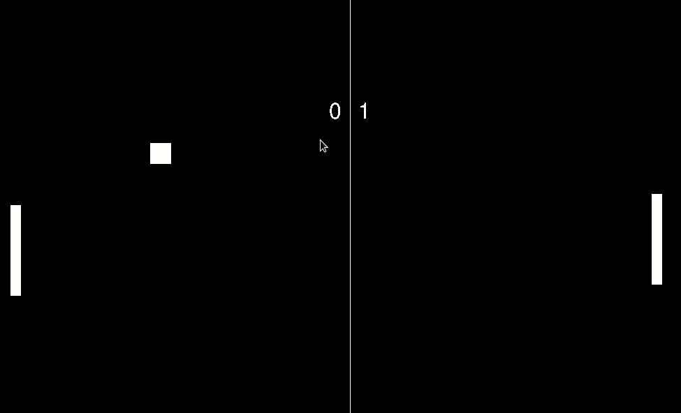

# Projeto do Jogo Pong feito em Python

### Tabela de Conteudos
* Introdução
* Execução
* Jogabilidade

### Introdução

Este projeto foi feito bom base nos tutoriais do canal 
<a href="https://www.youtube.com/playlist?list=PL8ui5HK3oSiEk9HaKoVPxSZA03rmr9Z0k">Clear Code</a>
com o objetivo de aprender um pouco dos módulos do Pygame, com a criação do famoso jogo Pong.

### Execução

Para jogar, é necessário ter o Python em sua versão 3.x instalado 

### Jogabilidade

A movimentação é feita pelas setas ↑ e ↓ 
O jogo termina quando ou o Inimigo ou o Jogado atigem 7 pontos

